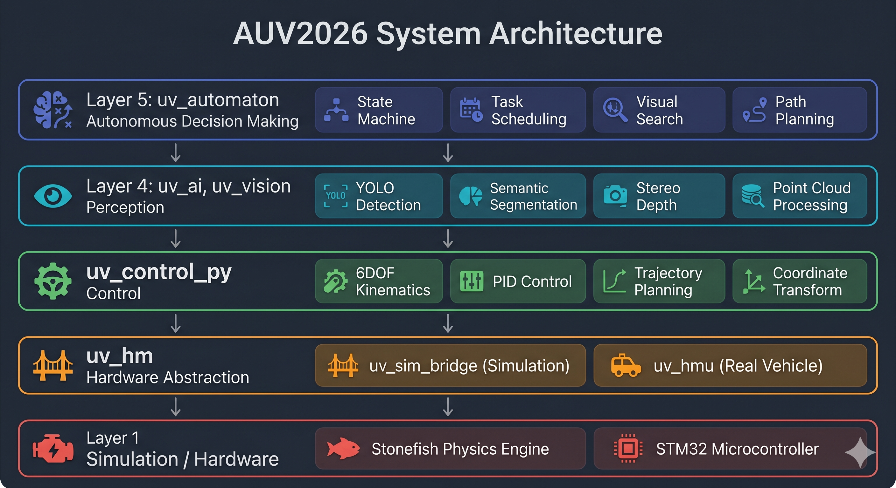

# AUV2026 项目核心仓库 (ROS 2 Jazzy)

欢迎使用 AUV2026 工作空间。这是一个基于 ROS 2 和 Stonefish 仿真器的综合性机器人开发框架，涵盖了自主水下机器人 (AUV) 的算法、感知、机械臂控制及物理仿真。

## 🏗 项目亮点

- **端到端仿真**：通过 `stonefish_ros2` 集成了完整的流体动力学、DVL、IMU 和 6 自由度物理模型。
- **先进视觉流水线**：具备双目相机点云投影 (`uv_vision` 和 `pc_recorder`) 以及基于 YOLO26 (`uv_ai`) 的实时目标检测。
- **基于状态机的自主任务**：依托灵活的 `uv_automaton` 实现任务序列自动化（巡线、过门、抓取控制）。
- **控制架构**：利用 PID 组件和预定义曲线轨迹实现闭环连续运动控制。



## 📚 文档指南

想要深入了解？请查阅 `doc/` 目录中最新迁移的指南：

| 文档名称                            | 用途                                                    |
| ----------------------------------- | ------------------------------------------------------- |
| [快速入门](doc/GETTING_STARTED.md)     | **环境配置/编译检查清单** 及运行指令。            |
| [系统架构](doc/ARCHITECTURE.md)        | **节点间如何通信** 以及系统层级结构概述。         |
| [节点参考](doc/NODES.md)               | 栈中每个节点的**发布者、订阅者及服务** 详细列表。 |
| [消息配置](doc/MESSAGES.md)            | **自定义消息载荷定义**，映射业务逻辑架构。        |
| [状态机动作](doc/AUTOMATON_ACTIONS.md) | 自定义任务调度器提供的动作列表与指令说明。              |

## 🛠 仓库目录结构

```text
AUV2026/
├── src/
│   ├── uv_ai/             # AI 处理、自主任务规则与点云记录
│   ├── uv_vision/         # SGBM 双目深度图生成与视觉处理
│   ├── uv_control_py/     # 推进器推力分配与 PID 控制逻辑
│   ├── uv_hm/             # 硬件管理 / 桥接层 (串口 / 虚拟)
│   ├── uv_msgs/           # 项目自定义 ROS2 消息定义
│   ├── uv_launch_pkg/     # 核心启动脚本与配置
│   ├── stonefish_ros2/    # 集成的仿真器组件
│   └── datas/             # 视觉模型 (.pt), 参数 (.npz) 与配置文件 (.json)
├── doc/                   # 开发指南与 Copilot 知识库 (Memories)
├── agents/                # 专门的 AI Agent 上下文提示词
├── scripts/               # 环境配置脚本 (env.sh)
└── GUI/                   # (可选) 可视化控制终端
```

*注意：`UUV2025` 和 `Cruise` 历史命名空间已正式废弃。请务必使用基于 AUV2026 根目录定义的路径。*

---

# AUV2026 Core Project Repository (ROS 2 Jazzy)

Welcome to the AUV2026 workspace, a comprehensive framework built with ROS 2 and Stonefish Simulator for Autonomous Underwater Vehicle (AUV) algorithms, sensing, manipulation, and physical simulation.

## 🏗 Project Highlights

- **End-to-end Simulation**: Complete multi-fluid physics, DVL, IMU, and 6-DoF models integrated via `stonefish_ros2`.
- **Advanced Vision Pipeline**: Features dual-camera point-cloud projection (`uv_vision` and `pc_recorder`) and real-time state-of-the-art YOLOv8 (`uv_ai`) object detection.
- **Autonomy via State Machines**: Built on the flexible `uv_automaton` for automated task sequencing (line following, gating, grasping manipulation).
- **Control Architecture**: Closed-loop continuous control utilizing PID components and predefined curve trajectories.

## 📚 Documentation

Review the guides in our central `doc/` repository:

| Document                                   | Purpose                                                                  |
| ------------------------------------------ | ------------------------------------------------------------------------ |
| [Getting Started](doc/GETTING_STARTED.md)     | **Setup/Build checklist** & launching instructions.                |
| [Architecture](doc/ARCHITECTURE.md)           | **How nodes talk to each other** & structural overview.            |
| [Nodes Reference](doc/NODES.md)               | **Publishers, Subscribers, services** for every node in the stack. |
| [Messages Config](doc/MESSAGES.md)            | **Message payloads definition** mapping custom logic schemas.      |
| [Automaton Actions](doc/AUTOMATON_ACTIONS.md) | Action list and commands provided by our specific Task Orchestrator.     |
